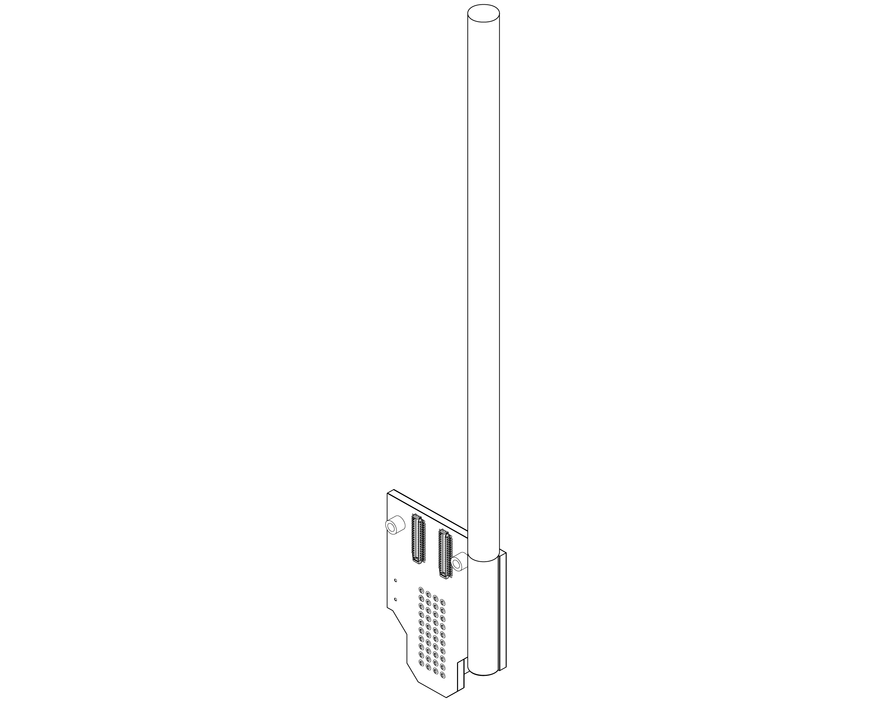
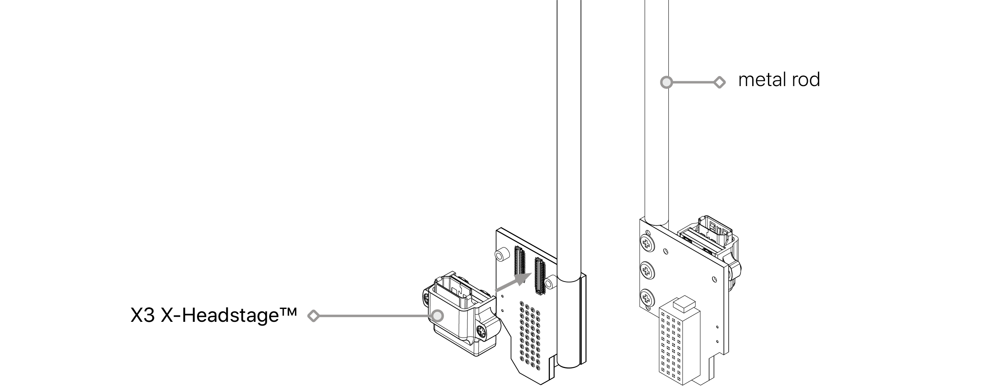
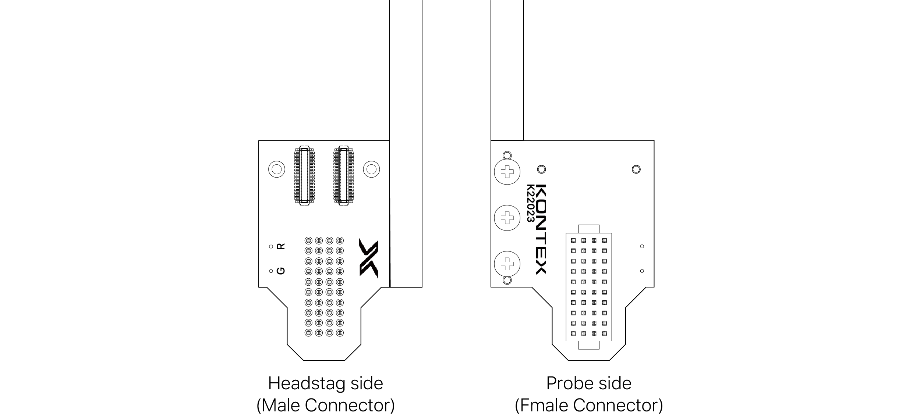
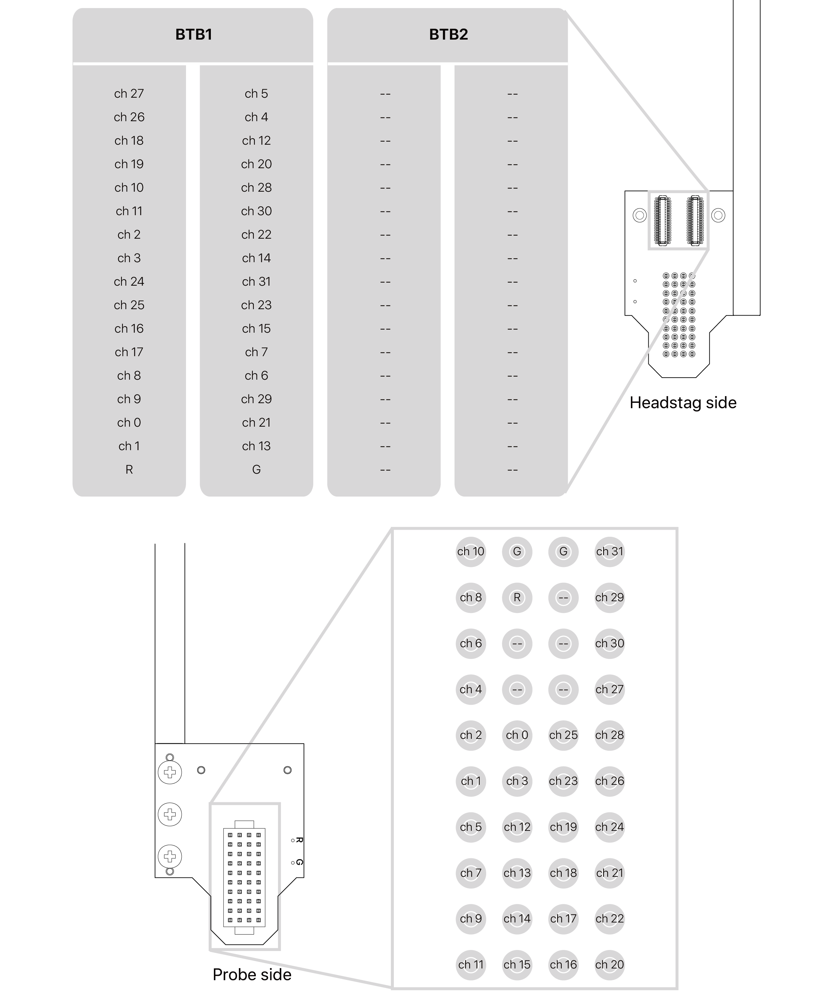

---

   

      

### **Overview**

  The Adpt-A-series probe adapter enables seamless integration between acute-style neural probes and the X3 X-Headstage™. Designed for versatility, these adapters support 16-, 32-, and 64-channel probes, ensuring broad compatibility with a wide range of neural probes available on the market.

      

### **Adpt-A32 Overview**

Adpt-A32

   

### **Connector**

    <h4> Headstage </h4>
    <ul>
    <li>Molex PN: 505070-3422
    </li>
    <h4> Probe </h4>
    <li>Samtec PN: FOLC-110-01-S-Q
    </li>
    <li>Compatiable NNx probes: A32, MRA32, OA32LP, OA32LP V2, OXA32LP
    </li>
    </ul>

   

### **Dimension**

    
unit: mm

   

### **Versions**

    <h4> V1: Identified by K22023 on PCB </h4>
    Original design

   

    <h4> V1.1: Identified by 100012A on PCB </h4>
    
A V1.1 of the Adapt-A32 adapter has been introduced with an updated grounding scheme. In this version, previously unused pins are now internally connected to ground (GND) to enhance electrical stability and signal robustness during neural recordings.

    In addition, while the original design was optimized for use with the X3R32 headstage, the updated version is also fully compatible with the X3R64, offering greater flexibility across experimental setups.

   

    <h4> V1 & 1.1 Adapter (SKU: Adpt-A16v1 & v1.1) </h4>
    <ul>
    <Li>Ground (G) and reference (R) signals are independent by default.</Li>
    <Li>To short them together at the adapter, solder a short wire between the G and R pads</Li>
    </ul>

   

### **Pin Map**

    <h4> V1.1: Identified by 100012A on PCB </h4>

   

    <h4> V1: Identified by K22023 on PCB </h4>

     

---

