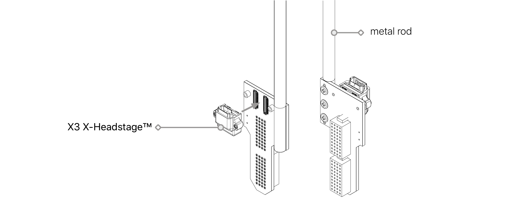
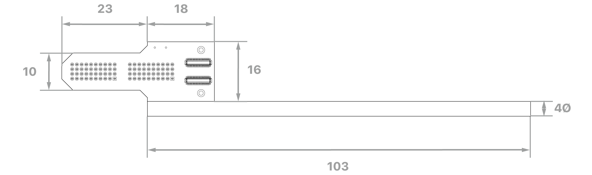
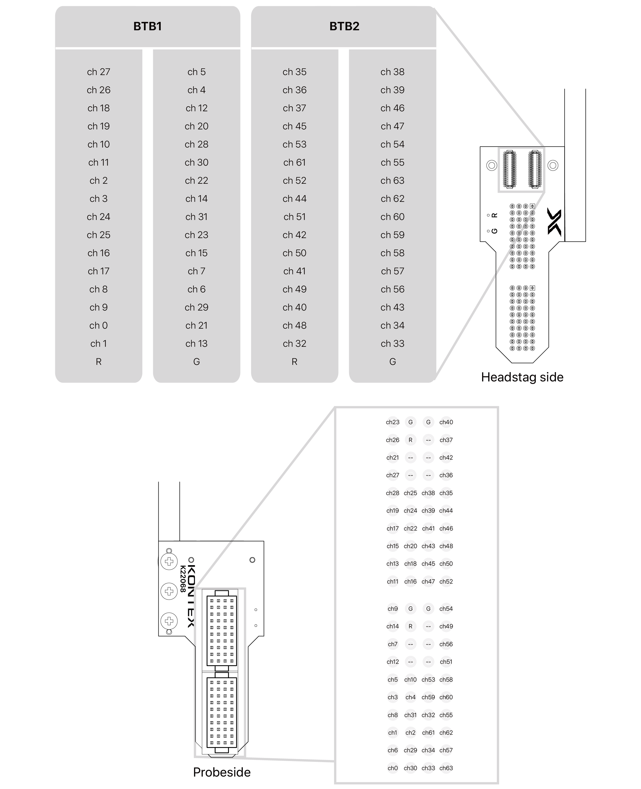

---

   

      

### **Overview**

  The Adpt-A-series probe adapter enables seamless integration between acute-style neural probes and the X3 X-Headstage™. Designed for versatility, these adapters support 16-, 32-, and 64-channel probes, ensuring broad compatibility with a wide range of neural probes available on the market.

      

### **Adpt-A64 Overview**

Adpt-A64

   

### **Connector**

    <h4> Headstage </h4>
    <ul>
    <li>Molex PN: 505070-3422
    </li>
    <h4> Probe </h4>
    <li>Samtec PN: FOLC-110-01-S-Q
    </li>
    <li>Compatible Neuronexus probes: A64, MRA64, OA64LP, OA64LP V2
    </li>
    </ul>

   

### **Dimension**

    
unit: mm

   

### **Adpt-A64 (SKU: Adpt-A64v1)**

    <Li>Ground (G) and reference (R) signals are independent by default.</Li>
    <Li>To short them together at the adapter, solder a short wire between the G and R pads</Li>

   

### **Pin Map**

    <h4> V1.1: Identified by 100012A on PCB </h4>

     

---

