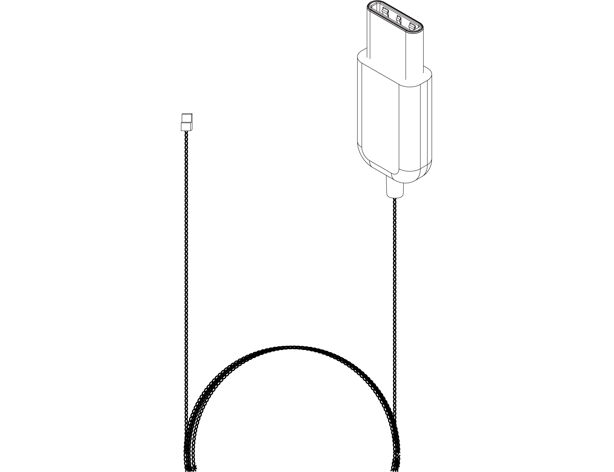

---

   

      

### **Overview**

  The KonteX Neuropixels cable features an optimized design (~40% lighter than IMEC stock cable) engineered to ensure reliable data transmission while preserving mechanical flexibility and durability. Every cable undergoes rigorous performance and quality testing to meet the highest standards.

   

### **Dimension And Weight**

    
unit: mm

   

### **Connector**

   

### **Part Number**

Cable-NP- [Length] - [Connector]

     

---

