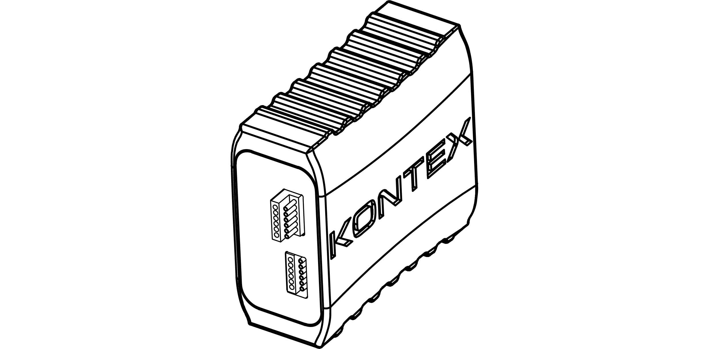
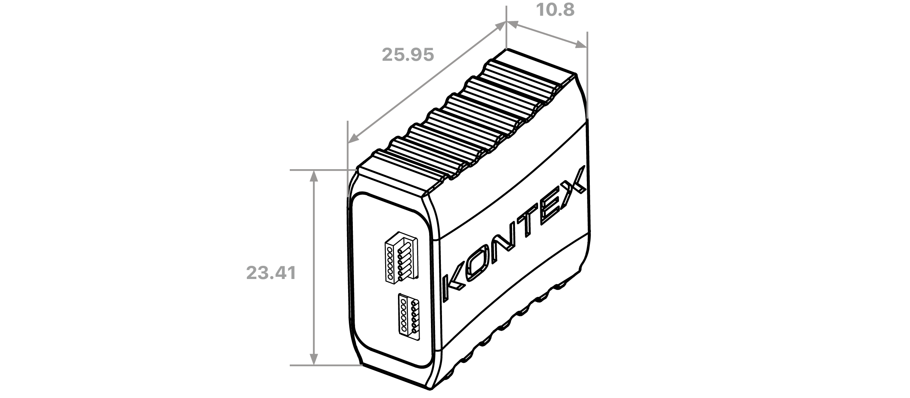
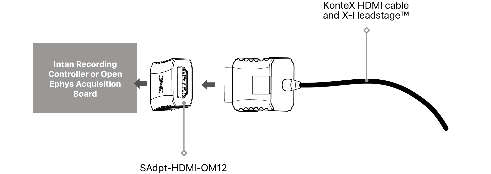
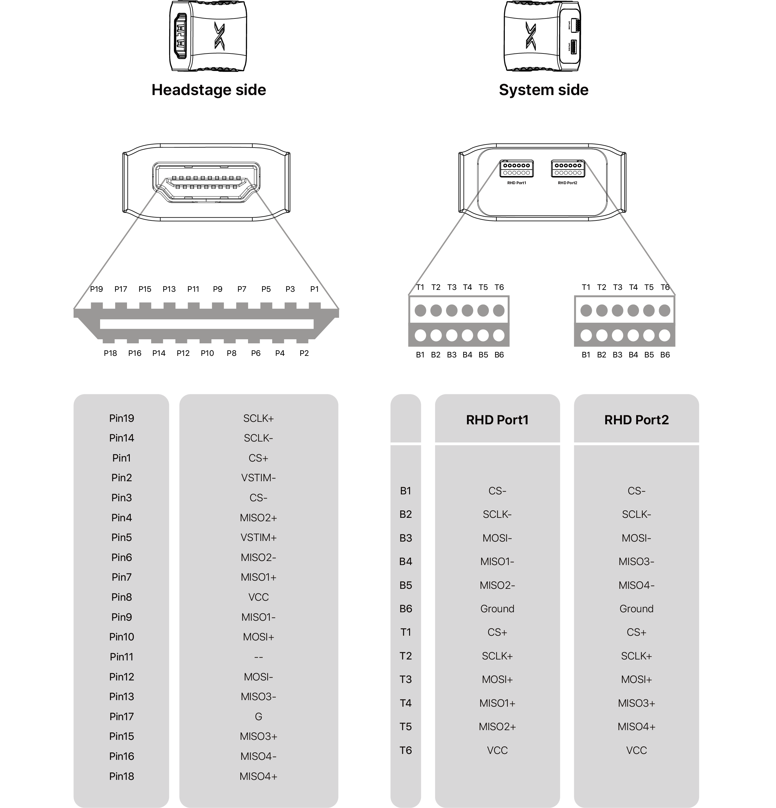

---

   

      

### **Overview**

  This adapter enables X-Headstages with KonteX HDMI cables to connect to the Intan Recording Controller via the Stim SPI cable.

   

### **SAdpt-HDMI-OM12 Overview**

 

 

SAdpt-HDMI-OM12

   

### **Dimension**

    
unit: mm

   

### **Usage Scenarios**

  The RHD P1 connector is recessed into a slot on the board, enabling direct plug-in to the acquisition box. Both the P1 and P2 connectors can also be used with an optional SPI cable to extend the connection to the acquisition system.

 

   

### **Connector**

    <h4> HDMI </h4>
    <li>HDMI Type A female
    </li>
    <h4> Intan/Open Ephys </h4>
    <li>Omnetics Polarized NANO 12-pin
    </li>

   

### **Pin Map**
 

     

---

