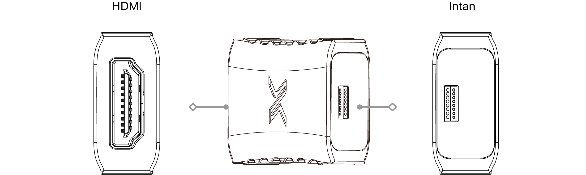
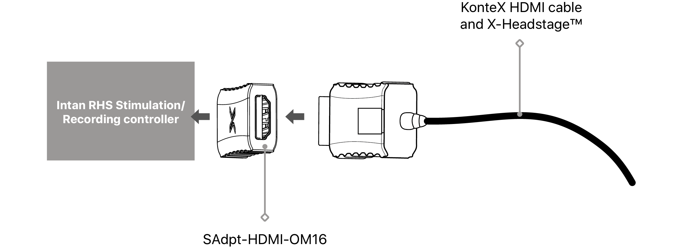
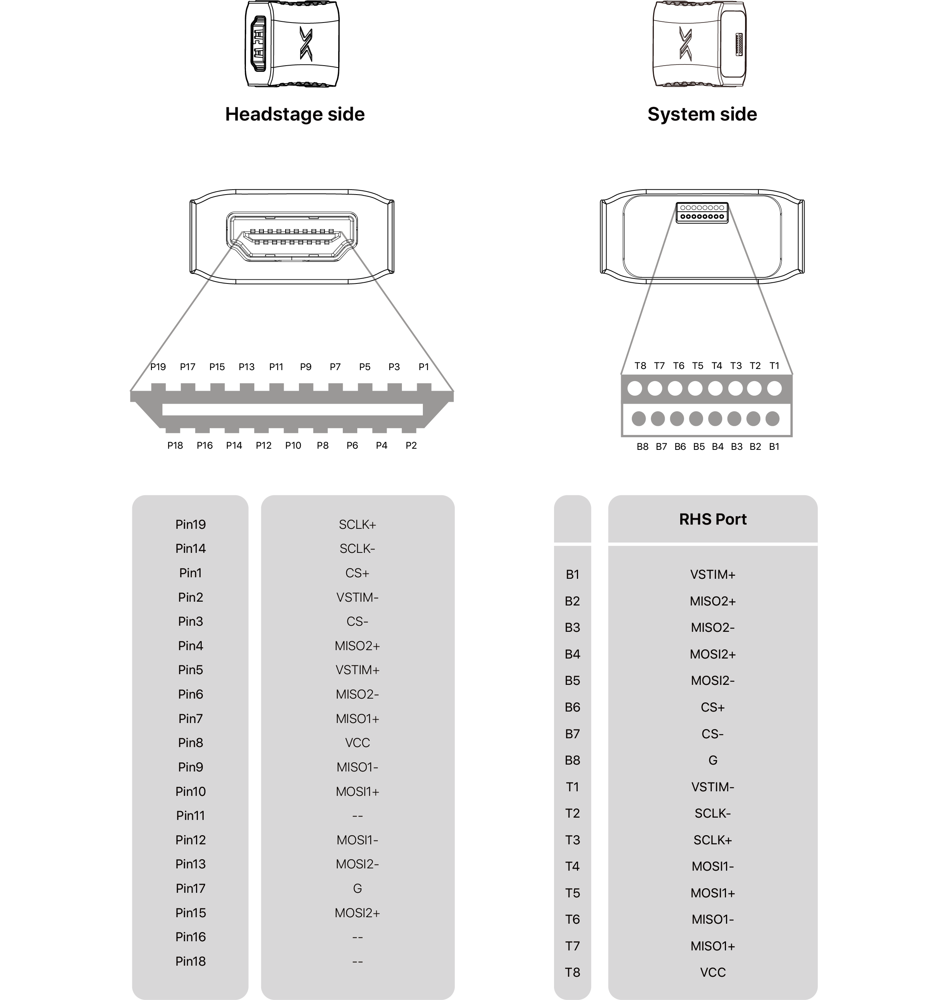

---

   

      

### **Overview**

  This adapter allows XSR headstages to operate seamlessly with the Intan Stimulation/Recording Controller using a Stim SPI cable.

   

### **SAdpt-HDMI-OM16 Overview**

 

 

SAdpt-HDMI-OM16

   

### **Dimension**

    
unit: mm

   

### **Usage Scenarios**

  The RHS connector is recessed into a slot on the board, enabling direct plug-in to the acquisition box. It can also be used with an optional Stim SPI cable to extend the connection to the acquisition system.

 

   

### **Connector**

    <h4> HDMI </h4>
    <li>HDMI Type A female
    </li>
    <h4> Intan/Open Ephys </h4>
    <li>Omnetics Polarized NANO 12-pin
    </li>

   

### **Pin Map**
 

     

---

